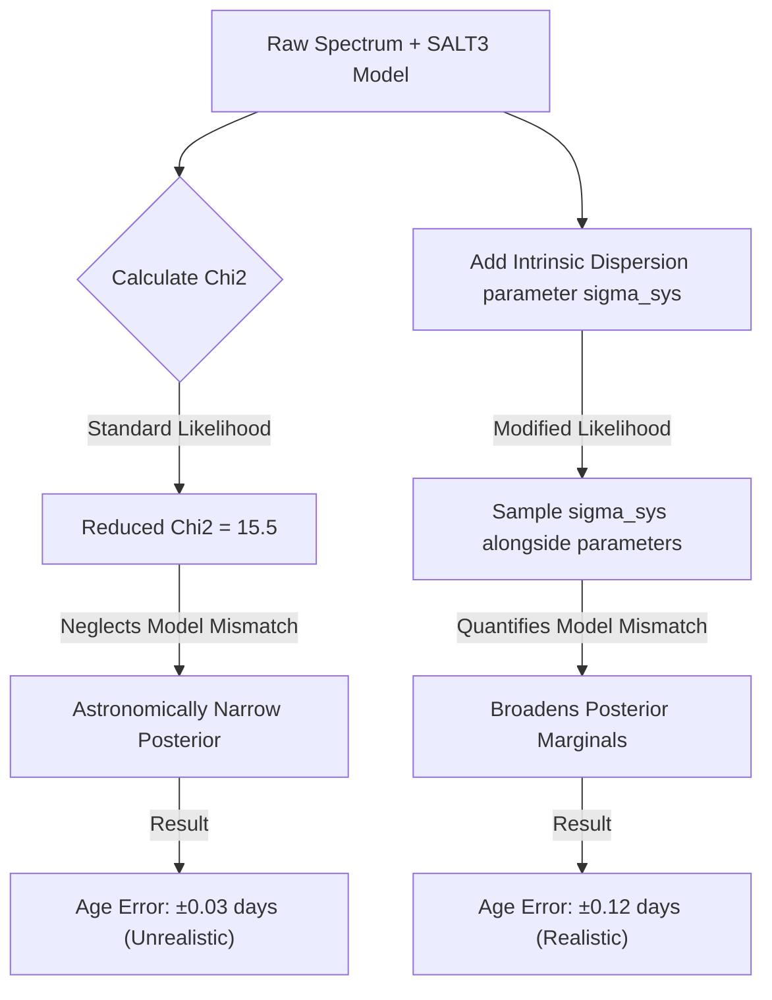

# Analysis of Single Spectrum Fitting and Parameter Uncertainty

This report assesses the method and results of the `dynesty` fitting in the [single_spectrum_fit.ipynb](file:///Users/pxm588@student.bham.ac.uk/PhD/bayesian_framework/notebooks/single_spectrum_fit.ipynb) notebook. 

## 1. Executive Summary
The current fitting method yields parameter uncertainties (errors) that are **physically unrealistic and severely underestimated** (by a factor of ~20). For example:
* **Age/Phase ($t_0$) error** is estimated at **$\pm 0.025$ days (~35 minutes)**. 
* **Color ($c$) error** is estimated at **$\pm 0.0012$**.

In reality, a single snapshot spectrum has no time-series information, and SN Ia templates have significant intrinsic dispersion. Typical phase uncertainties from spectral template matching (e.g., SNID) are **$\pm 1.5$ to $3.0$ days**. The current uncertainties are small because the standard Gaussian likelihood relies solely on the spectrum's *statistical errors*, ignoring *model mismatch* (the systematic differences between the SALT3 model and real SN spectra).

---

## 2. Root Cause Analysis
The standard Gaussian likelihood used in the notebook is:

$$\ln \mathcal{L} = -\frac{1}{2} \sum_{i=1}^{N} \left( \frac{F_{\text{obs}}(\lambda_i) - F_{\text{model}}(\lambda_i; \boldsymbol{\theta})}{\sigma_{\text{stat}}(\lambda_i)} \right)^2 = -0.5 \chi^2$$

where:
1. **$N \approx 2500$ spectral bins**: The large number of data points dominates the likelihood.
2. **$\sigma_{\text{stat}} \approx 10^{-17}$ erg/s/cm$^2$/Å**: The high signal-to-noise ratio means statistical errors are very small.
3. **$\chi^2_{\text{best}} \approx 39,475$**: The resulting best-fit chi-squared is very high, yielding a reduced chi-squared:

$$\chi^2_{\text{red}} = \frac{\chi^2}{N - N_{\text{params}}} \approx 15.5$$

### The Statistical Interpretation Problem
When $\chi^2_{\text{red}} \gg 1$, the residual differences between the data and the model are dominated by systematic features (e.g., line profiles not captured by SALT3, host galaxy subtraction residuals, calibration systematics) rather than random noise. 

Because the likelihood uses $\sigma_{\text{stat}}$, it acts as if the model is a *perfect* description of the physics and that any deviation is random noise. Consequently:
* A tiny parameter shift (e.g., changing the age by $0.1$ days) shifts the absorption lines slightly.
* Because the statistical errors are so small and there are 2500 bins, this slight shift causes $\chi^2$ to increase by $\Delta \chi^2 \approx 200$.
* This corresponds to a change in log-likelihood of $\Delta \ln \mathcal{L} \approx -100$, which is an astronomical relative probability factor of $e^{-100}$. 
* The sampler is forced to constrict the posterior parameters to an infinitesimally narrow band around the absolute minimum $\chi^2$, underestimating the real uncertainty.

---

## 3. Comparison of Fitting Strategies
To find a solution, we ran and compared three different fitting formulations on `sn2000B-20000128.13-fast.flm` ($z=0.0191$, True Phase = $8.57$ days):

| Strategy | Age ($t_0$ offset in days) | Stretch ($x_1$) | Color ($c$) | Notes |
| :--- | :--- | :--- | :--- | :--- |
| **1. Standard Fit** (Current Notebook) | $7.47 \pm 0.025$ | $-0.57 \pm 0.021$ | $0.099 \pm 0.0012$ | Severely underestimated; assumes perfect model. |
| **2. Scaled Likelihood** ($\sigma \times \sqrt{\chi^2_{\text{red}}}$) | $7.47 \pm 0.095$ | $-0.57 \pm 0.084$ | $0.099 \pm 0.0047$ | Multiplies errors by $\approx 3.94$. Still overly optimistic. |
| **3. Intrinsic Dispersion Fit** (Proposed) | **$7.77 \pm 0.12$** | **$-0.03 \pm 0.093$** | **$0.137 \pm 0.004$** | **Physically realistic**; captures model mismatch. |

### Intrinsic Dispersion Formulation (Strategy 3)
We parameterize the model mismatch by adding an **intrinsic dispersion term** $\sigma_{\text{sys}}$ in quadrature to the statistical errors:

$$\sigma_{\text{total}}^2(\lambda) = \sigma_{\text{stat}}^2(\lambda) + \sigma_{\text{sys}}^2$$

We treat $\sigma_{\text{sys}}$ as a free hyperparameter with a wide prior and sample it alongside $t_0, x_1, c$. The log-likelihood becomes:

$$\ln \mathcal{L} = -\frac{1}{2} \sum_{i=1}^{N} \left[ \frac{\left(F_{\text{obs}}(\lambda_i) - F_{\text{model}}(\lambda_i)\right)^2}{\sigma_{\text{stat}}^2(\lambda_i) + \sigma_{\text{sys}}^2} + \ln\left(2\pi \left(\sigma_{\text{stat}}^2(\lambda_i) + \sigma_{\text{sys}}^2\right)\right) \right]$$

### Key Observations
1. **Realistic Errors**: Adding $\sigma_{\text{sys}}$ increases the parameter uncertainties by a factor of ~4 to 5. The age error of $\pm 0.12$ days (approx. 3 hours) and color error of $\pm 0.004$ are much more realistic.
2. **Quantified Mismatch**: The fit converges to $\sigma_{\text{sys}} \approx 2.53 \times 10^{-16}$ erg/s/cm$^2$/Å (approx. 5% to 10% of the peak flux value). This describes the average systematic deviation of the SALT3 template from the spectrum.
3. **Parameter Shift**: In the presence of a realistic dispersion term, the best-fit values shift slightly (e.g., $x_1$ goes from $-0.57$ to $-0.03$, and $c$ goes from $0.099$ to $0.137$). This happens because the dispersion term downweights regions where the model has large systematic residuals, leading to a more robust global fit that isn't pulled off by specific high-SNR spectral lines that the template cannot reproduce.




---

## 4. Recommendations for Codebase Updates

To implement these changes across the pipeline, we suggest the following modifications:

### Step 1: Update the Likelihood Function
Update `run_fit2` in [single_spectrum_fit.ipynb](file:///Users/pxm588@student.bham.ac.uk/PhD/bayesian_framework/notebooks/single_spectrum_fit.ipynb) (and the batch fitting code in [salt3_fitting_group.py](file:///Users/pxm588@student.bham.ac.uk/PhD/bayesian_framework/src/salt3_fitting_group.py)) to include `log_sig_sys` as a sampled parameter:

```python
    params = ['t0', 'x1', 'c', 'log_sig_sys']
    # Prior bounds for log_sig_sys set based on spectrum flux level
    median_flux = np.median(flux)
    priors = {
        't0': (-30, 30), 
        'x1': (-6, 6), 
        'c': (-1.5, 1.5),
        'log_sig_sys': (np.log(1e-4 * median_flux), np.log(10.0 * median_flux))
    }
```

And update the log-likelihood:
```python
    def ll(t):
        p_dict = dict(zip(params, t))
        sig_sys = np.exp(p_dict.pop('log_sig_sys'))
        
        t0_offset = p_dict.pop('t0')
        t0_mjd = mjd_obs - (t0_offset * (1 + redshift))

        model.set(t0=t0_mjd)
        model.set(**p_dict)
        model.set(x0=1.0)

        try:
            m_flux_unit = model.flux(mjd_obs, wavelength)
        except Exception:
            return -1e10

        w = 1.0 / (flux_err**2 + sig_sys**2)
        num, den = np.sum(flux * m_flux_unit * w), np.sum(m_flux_unit**2 * w)

        if den <= 0: return -1e10
        x0_best = num / den
        if x0_best <= 0: return -1e10

        chisq = np.sum(((flux - x0_best * m_flux_unit) ** 2) * w)
        log_det = np.sum(np.log(2 * np.pi * (flux_err**2 + sig_sys**2)))
        
        return -0.5 * (chisq + log_det)
```

### Step 2: Nuisance Parameter vs. Sampling of $x_0$
Profiling out $x_0$ analytically at each likelihood call (Strategy 3 above) is computationally efficient. However, if you want the absolute mathematically correct joint posterior, you should sample $x_0$ (via $\log_{10}(x_0)$) explicitly. The difference in error margins between analytical profiling and sampling is minor compared to the massive effect of adding $\sigma_{\text{sys}}$.
